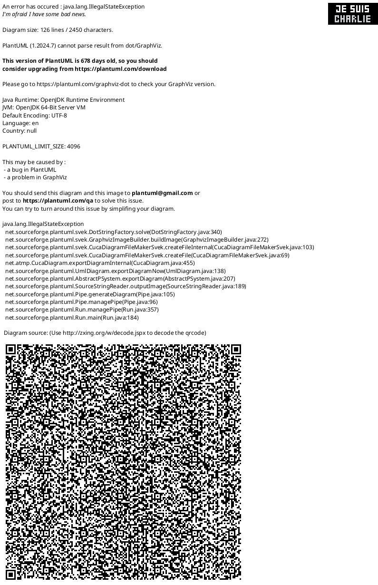

# Detailed Design Document

| **Author**              | `Ahmed Emad, Arwa Hesham, Hamza Abbas`                                       |
|:------------------------|:-----------------------------------------------------|
| **Status**              | `Approved`                          |
| **Version**             | `1.0`                                                |
| **Date**                | `9/12/2025`                                         |

## Introduction

This project implements an embedded air-conditioning control system similar to those used in automotive applications. The system allows the user to set a desired temperature using either a keypad or two external buttons. An LM35 sensor measures the real-time ambient temperature, which is shown on an LCD display. Based on the temperature difference, a DC motor (acting as the AC fan) adjusts its direction and speed automatically. An LED indicates whether the motor is running, and an EEPROM stores the last configured temperature for use after restart. The project demonstrates practical embedded system design, sensor interfacing, motor control, and user interaction.

### Purpose

The purpose of this project is to design and implement a simple embedded climate-control system that allows the user to set a desired temperature and automatically adjusts a DC fan motor based on real-time readings from an LM35 sensor. The system demonstrates practical embedded control through keypad input, button interaction, temperature sensing, motor direction and speed control, and persistent storage of settings..

### Scope

Setting required temperature using a keypad (Mode 1)

Adjusting temperature using two buttons (Mode 2)

Real-time temperature sensing with an LM35 sensor

LCD display for system information

DC motor fan control with direction and speed variation

LED indicator for motor ON/OFF status

Storing the last temperature in EEPROM

Push button mode switching and input debounce handling

## Architectural Overview

The system is organized into a three-layer architecture that separates the main application logic from the hardware control and low-level drivers.

### Assumptions & Constraints

Assumptions:

- Users will input sensible values.

Constrains:

- The microcontroller operates at a stable 16 MHz clock speed.
- lcd display only 16*2 characters it allows only display 32 characters on two lines at a time .

## Functional Description

| Function  | Description |
|-----------|--------------------------------------|
| Sensor Data Acquisition | Continuously reads temperature values from the LM35 sensor through the ADC module and converts raw ADC values into Celsius for comparison with the desired temperature.|

| LCD Display Management | Updates the LCD to show the current room temperature, desired temperature, and system mode, using controlled refresh techniques to minimize flicker.|

| User Input Handling | Processes inputs from the keypad for entering the desired temperature in Mode 1 and from push buttons to increment/decrement the temperature in Mode 2, including debouncing and validation.|

| Threshold Monitoring & Fan Control | Compares the real-time temperature with the desired temperature and adjusts the DC motor (fan) speed and direction accordingly to reach the target temperature.|

| LED Indicator Control |  Turns the LED ON when the motor (fan) is running and OFF when the motor stops. |

| Mode Switching |  Detects the push button press to switch between Mode 1 (keypad input) and Mode 2 (increment/decrement buttons) and updates the system behavior accordingly.|

## Implementation of the Module

| Implementation Aspect |Description                                   |
|-----------------------|-------------------------------------------------|
| System Initialization | Configures all hardware peripherals at startup, including the ADC for the LM35 sensor, GPIO pins for push buttons and LED, PWM for the DC motor, and the 16×2 LCD. Buttons are configured as inputs with pull-ups, the LED as output, and the motor PWM initialized for speed and direction control.|
| ADC Data Processing   | Initiates ADC conversions for the LM35 sensor, retrieves digital readings, and converts them into Celsius temperature values using calibrated scaling. Ensures stable measurements by managing sampling timing and filtering out noise.|
| LCD Output Handling   | Formats the current room temperature, desired temperature, and system mode into display strings and updates the 16×2 LCD using low-level command/data functions. Refreshing occurs only when values change to minimize flicker.|
| User Input Handling |Reads user input from the keypad (Mode 1) or increment/decrement push buttons (Mode 2). Implements debouncing, validation, and ensures the desired temperature remains within allowable ranges.|
| Threshold Evaluation & Fan Control |Compares the real-time temperature with the desired temperature and determines whether the fan should turn ON or OFF. Adjusts fan speed and direction using PWM to reach the target temperature efficiently.|
| LED Indicator Control | Turns the LED ON when the fan is running and OFF when the fan stops, providing a visual status of the motor operation.|
| Mode Switching Logic | Detects push button presses to switch between Mode 1 (keypad input) and Mode 2 (increment/decrement buttons), updating the system behavior and display accordingly.|

## Integration and Configuration

### Static Files

| File name      | Contents                                                                                                                    |
|----------------|-----------------------------------------------------------------------------------------------------------------------------|
| Main.ino        | Main application file that integrates all modules and controls program flow.                                                |
| ADC.ino        |  ADC source file that includes initialization, channel configuration, and analog-to-digital conversion routines.            |
| ADC.h          | ADC header file that defines ADC functions and configuration.                                                               |
| gpio.ino       | GPIO source file for controlling digital input/output pins.                                                                 |
| gpio.h         | GPIO header file that declares GPIO-related functions.                                                                      |
| Commen_macros.h | header file that contains shared macros, used across the application.                  |
| Button.ino     | Button source file for reading and processing button states.                                                                |
| Button.h       | Button header file that provides function prototypes for button handling.                                                   |
| lcd_i2c.ino        | Source file implementing including command writing, data handling, cursor control, and text formatting for the 16×2 display.|
| lcd_i2c.h          | lcd header file that has prototypes, constants, and LCD command definitions.                                                |
handling.                                                 |
| lm35.ino       | lm35 Source file that Implements LM35 temperature sensor reading and data conversion logic.                                 |
| lm35.h         | lm35 header file that provides function prototypes for lm35 reading handling.                                               |
| led.ino        | LED source file for controlling LED operations.                                                                             |
| led.h          |LED header file defining LED control functions and constants.                                                                |

### Include Structure

### Configuration

| Name                | Value range         | Description                                                                     |
| ------------------- | ------------------- | ------------------------------------------------------------------------------- |
| Debounce Delay      | 50 ms               | Software delay to prevent false button triggers.                                |
| LED Pin             | Pin 4 (PORTB)       | Digital output pin controlling the LED indicator for the fan.                   |
| Motor PWM Pin       | Pin 9 (OC1A, PORTB) | PWM output pin controlling the fan speed.                                       |
| Motor Direction Pin | Pin 8 (PORTB)       | Digital output pin controlling the fan rotation direction.                      |
| Keypad Pins         | Pins 2–7 (PORTD)    | Digital input pins connected to the keypad rows and columns.                    |
| Push Button Pins    | Pin 10, Pin 11      | Digital input pins used to increment/decrement desired temperature in Mode 2.   |
| Mode Selection Btn  | Pin 3 (PORTD)       | Push button to switch between Mode 1 (keypad) and Mode 2 (increment/decrement). |
| LCD Pins            | Pins 12–13, A0–A3   | Digital/analog pins connected to the 16×2 LCD for data and control lines.       |
| LM35 Sensor Pin     | Analog Pin A4       | Analog input pin connected to LM35 temperature sensor.                          |
| RTC Module          | I2C (SDA, SCL)      | Real-time clock module connected via I2C for time-based features.               |
| EEPROM Module       | I2C (SDA, SCL)      | Non-volatile memory to store user settings like desired temperature.            |
| Microcontroller     | ATmega328P          | Target MCU used for implementation.|
